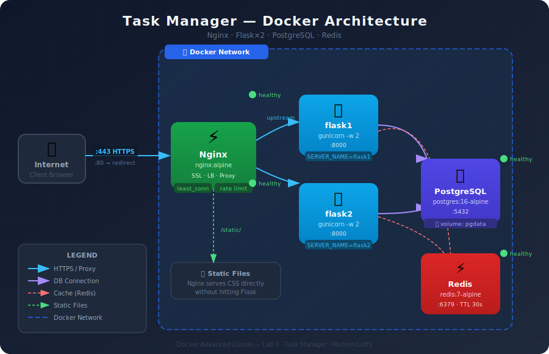

<div align="center">

# 🐳 Task Manager

**Production-ready containerized task management application**

[](https://www.docker.com/)
[](https://nginx.org/)
[](https://flask.palletsprojects.com/)
[](https://www.postgresql.org/)
[](https://redis.io/)

[](https://docs.docker.com/compose/)
[](https://python.org)
[]()

<br/>

*Docker Advanced Course — Lab 7*

</div>

---

## 📐 Architecture

<div align="center">
  
</div>

<br/>

The stack runs entirely inside a **Docker bridge network**. Nginx is the single entry point — it handles SSL termination, HTTP→HTTPS redirect, static file serving, and load balancing across two Flask instances. Both Flask instances share the same PostgreSQL database and Redis cache.

---

## 🗂️ Project Structure

```
task-manager-docker/
│
├── 🐍  flask_app.py            # REST API — 5 endpoints
├── 🗄️  init.sql                # DB schema + seed data
├── 📦  requirements.txt        # Python dependencies
│
├── 🐳  Dockerfile              # Multi-stage build (builder → runtime)
├── 🐳  docker-compose.yml      # Orchestrates all 5 services
├── 🚫  .dockerignore           # Keeps secrets out of the image
├── 🔒  .env                    # Environment variables (git-ignored)
├── 📋  .env.example            # Template for .env
│
├── 📁  conf/
│   └── nginx.conf              # Upstream · SSL · Rate limiting
│
├── 📁  ssl/
│   └── generate_ssl.sh         # Generates self-signed certificate
│
└── 📁  static/
    └── style.css               # Frontend styles
```

---

## ⚙️ Services

| Service | Image | Port | Role |
|:---|:---|:---:|:---|
| **nginx** | `nginx:alpine` | 443 / 80 | Reverse proxy, SSL, load balancer |
| **flask1** | custom build | 8000 | App instance #1 |
| **flask2** | custom build | 8000 | App instance #2 |
| **postgres** | `postgres:16-alpine` | 5432 | Primary database |
| **redis** | `redis:7-alpine` | 6379 | Response cache (TTL 30s) |

---

## 🚀 Quick Start

### Prerequisites
- [Docker Desktop](https://www.docker.com/products/docker-desktop/) installed and running
- `openssl` available in your terminal

### 1 — Clone
```bash
git clone https://github.com/MomenLotfy/task-manager-docker.git
cd task-manager-docker
```

### 2 — Configure environment
```bash
cp .env.example .env
nano .env          # fill in your values
```

### 3 — Generate SSL certificate
```bash
cd ssl && bash generate_ssl.sh && cd ..
```

> This creates `ssl/certs/nginx.crt` and `ssl/private/nginx.key`

### 4 — Build & run
```bash
docker compose up -d --build
```

> ⏳ First run takes 3–5 minutes to build the Flask image

### 5 — Verify all services are healthy
```bash
docker compose ps
```

Expected output:
```
NAME       STATUS
nginx      Up (healthy)
flask1     Up (healthy)
flask2     Up (healthy)
postgres   Up (healthy)
redis      Up (healthy)
```

### 6 — Open in browser
```
https://localhost
```
> Click **Advanced → Proceed to localhost** to bypass the self-signed cert warning

---

## 🔌 API Reference

| Method | Endpoint | Description | Cached |
|:---:|:---|:---|:---:|
| `GET` | `/` | Main UI with task list | — |
| `GET` | `/api/health` | Health check — DB + Redis status | — |
| `GET` | `/api/tasks` | List all tasks | ✅ 30s |
| `POST` | `/api/tasks` | Create a new task | — |
| `PATCH` | `/api/tasks/<id>/done` | Mark task as complete | — |

### Examples

```bash
# Health check
curl -k https://localhost/api/health
# → {"status":"healthy","db":true,"redis":true,"worker":"flask1"}

# List tasks
curl -k https://localhost/api/tasks

# Create a task
curl -k -X POST https://localhost/api/tasks \
  -H "Content-Type: application/json" \
  -d '{"title":"Deploy to production","priority":"high"}'

# Mark task as done
curl -k -X PATCH https://localhost/api/tasks/1/done
# → {"message":"Task 1 marked done"}
```

### Test load balancing
```bash
# Run 3 times — worker should alternate between flask1 and flask2
curl -k https://localhost/api/health
curl -k https://localhost/api/health
curl -k https://localhost/api/health
```

---

## 🔑 Environment Variables

Copy `.env.example` to `.env` and set your values:

```env
# ── PostgreSQL ─────────────────────────────
POSTGRES_DB=taskmanager
POSTGRES_USER=taskuser
POSTGRES_PASSWORD=your_secure_password_here

# ── Flask App Connection ────────────────────
DB_HOST=postgres
DB_NAME=taskmanager
DB_USER=taskuser
DB_PASSWORD=your_secure_password_here

# ── Redis ───────────────────────────────────
REDIS_HOST=redis
```

> ⚠️ **Never commit `.env` to git** — it contains secrets and is listed in `.gitignore`

---

## 🏗️ Key Concepts

<details>
<summary><b>Multi-stage Dockerfile</b> — reduces image from ~1GB to ~120MB</summary>

<br/>

```dockerfile
# Stage 1: Builder — compile dependencies
FROM python:3.11-alpine AS builder
RUN apk add --no-cache gcc musl-dev libpq-dev
RUN pip install --prefix=/install -r requirements.txt

# Stage 2: Runtime — only what's needed to run
FROM python:3.11-alpine
RUN apk add --no-cache libpq wget
COPY --from=builder /install /usr/local
```

The builder stage contains compilers and dev headers that are **not needed at runtime**. The final image only copies the compiled packages.

</details>

<details>
<summary><b>Non-root User</b> — security best practice</summary>

<br/>

```dockerfile
RUN addgroup -S appgroup && adduser -S appuser -G appgroup
USER appuser
```

Running as root inside a container is a security risk. If a vulnerability is exploited, a non-root user limits the blast radius.

</details>

<details>
<summary><b>Health Checks + depends_on</b> — proper startup ordering</summary>

<br/>

```yaml
depends_on:
  postgres:
    condition: service_healthy   # waits for pg_isready ✅
  redis:
    condition: service_healthy   # waits for redis-cli ping ✅
```

Using `condition: service_healthy` ensures Flask never starts before the database is actually ready to accept connections — not just "started".

</details>

<details>
<summary><b>Load Balancing with least_conn</b></summary>

<br/>

```nginx
upstream task_backend {
    least_conn;           # route to server with fewest active connections
    server flask1:8000;
    server flask2:8000;
}
```

`least_conn` is smarter than round-robin for APIs where some requests take longer than others.

</details>

<details>
<summary><b>Redis Cache Layer</b></summary>

<br/>

```python
cached = r.get('tasks')
if cached:
    return jsonify(json.loads(cached))   # serve from cache ⚡

# fetch from DB and cache result
r.setex('tasks', 30, json.dumps(tasks)) # TTL: 30 seconds
```

`GET /api/tasks` is cached for 30 seconds. Any write (`POST` / `PATCH`) invalidates the cache immediately.

</details>

---

## 🔒 Security Highlights

| Feature | Implementation |
|:---|:---|
| HTTPS only | HTTP port 80 → permanent 301 redirect to HTTPS |
| TLS 1.2 / 1.3 only | Older vulnerable protocols explicitly disabled |
| Non-root container | Flask runs as `appuser`, never as `root` |
| No hardcoded secrets | All credentials loaded from `.env` at runtime |
| Secrets out of image | `.env` and `ssl/` listed in `.dockerignore` |
| Rate limiting | `limit_req_zone` on all API endpoints |
| Persistent data | Named volume `pgdata` — data survives container restarts |

---

## 🛠️ Useful Commands

```bash
# Check all services and their health
docker compose ps

# Watch live logs from all services
docker compose logs -f

# Check a specific service
docker compose logs flask1
docker compose logs nginx

# Access the database directly
docker exec -it postgres psql -U taskuser -d taskmanager -c '\dt'

# Check what's cached in Redis
docker exec -it redis redis-cli keys '*'

# Full reset — remove containers + volumes + rebuild
docker compose down -v && docker compose up -d --build
```

---

## 🐛 Troubleshooting

| Problem | Fix |
|:---|:---|
| `nginx: host not found flask1` | Flask isn't running — check `docker compose logs flask1` |
| `cannot load certificate` | Run `ssl/generate_ssl.sh` first — `ssl/certs/` is empty |
| `502 Bad Gateway` | Flask crashed — check `docker compose logs flask1` |
| `limit_req_zone not allowed here` | Move it outside `server {}` block — place after `upstream {}` |
| `Table tasks does not exist` | `init.sql` didn't run — try `docker compose down -v` then up again |
| `Permission denied on ssl/` | Run `sudo chown -R $USER:$USER ssl/` |
| Image not updated after changes | Always use `docker compose up -d --build` |

---

<div align="center">


Made with 🐳 by [Momen Lotfy](https://github.com/MomenLotfy)

</div>
